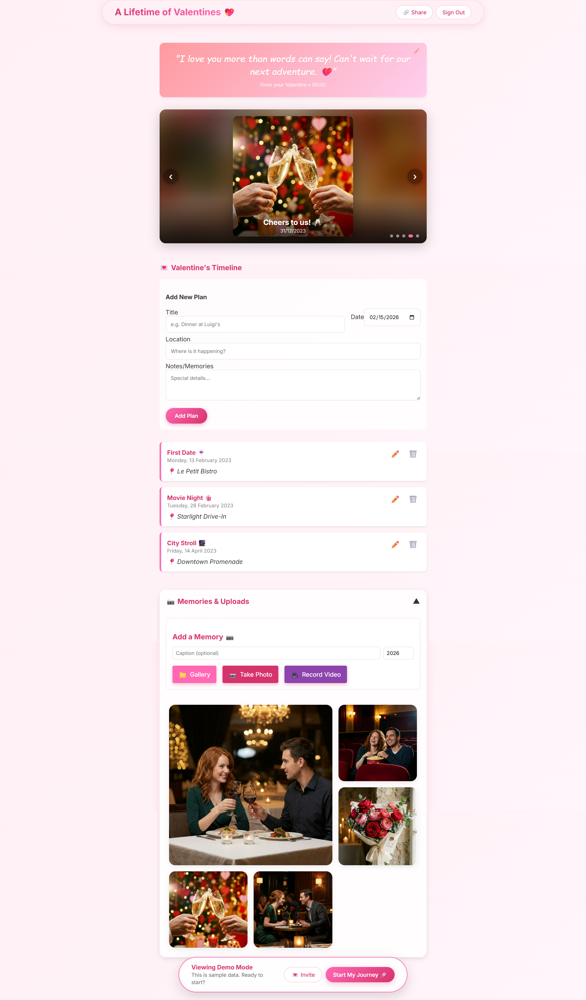
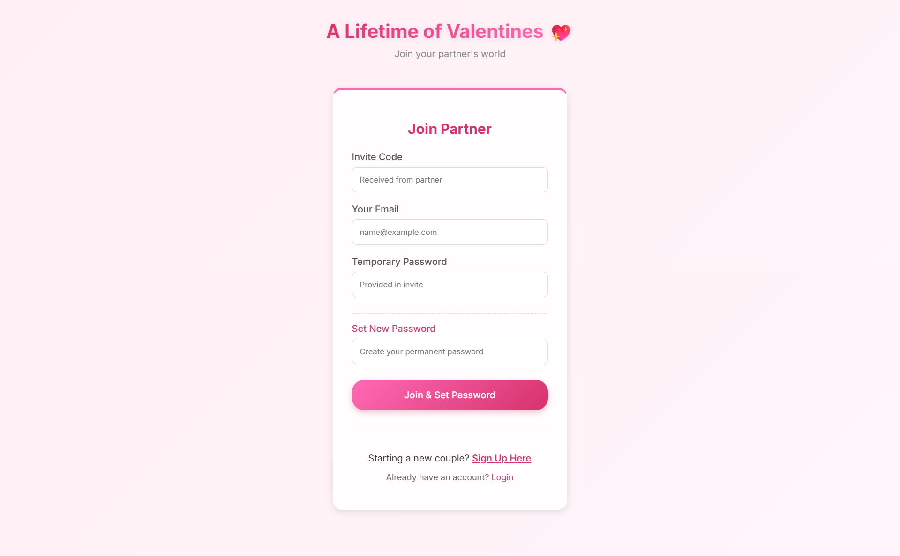
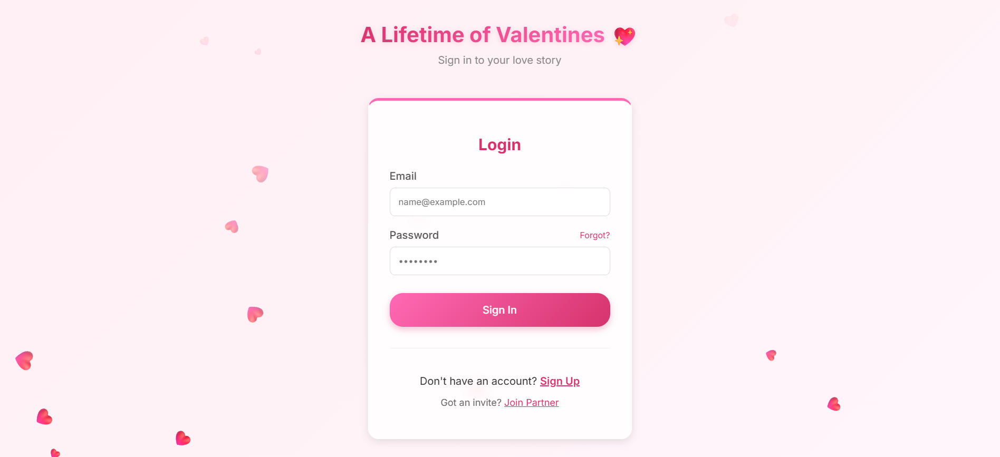
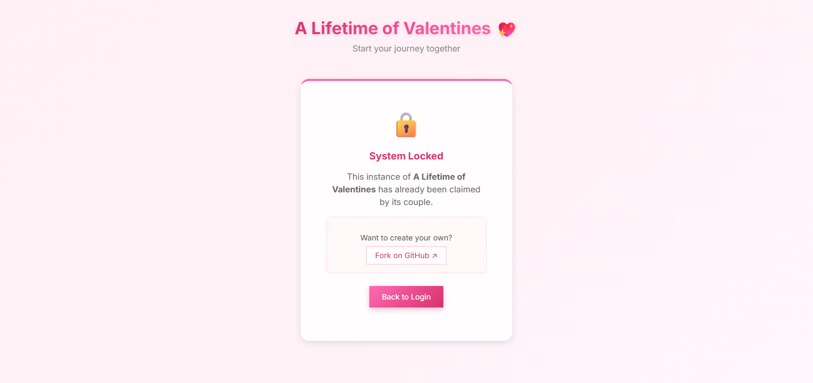

# A Lifetime of Valentines 💖

A private, shared digital timeline for couples to capture memories ("The Story of Us"), plan future dates ("The Story of Future Us"), and celebrate their journey together. 

Built with **React**, **Vite**, and **Supabase**. Secure, responsive, and designed to be deployed for just *you and your partner*.



## ✨ Features

- **Couple's Timeline**: Log special dates, future plans, and past memories.
- **Media Gallery**: Upload photos and videos directly to a private cloud storage.
- **Message Board**: A dedicated space for sweet notes to each other.
- **Privacy First**: Designed as a **Singleton Instance**. Once you and your partner join, the system **locks** automatically. No random strangers can sign up.
- **Secure Sharing**: Create strictly time-limited links (e.g., 1 hour, 6 hours) to share your timeline with friends and family without giving them permanent access.
- **Fail-Safe Auth**: Robust signup flow ensures you never get locked out during setup.
- **Password Recovery**: Secure, email-based password reset flow for peace of mind.
- **Mobile Optimized**: A beautiful, app-like experience on your phone.

## 🛠️ Stack

- **Frontend**: React, Vite, CSS Modules (Glassmorphism UI).
- **Backend/DB**: Supabase (PostgreSQL, Auth, Storage, Edge Functions).
- **Hosting**: Vercel (Recommended) or Netlify.

---

## 📹 Video Walkthrough (Coming Soon)
A complete, step-by-step video guide on how to fork, deploy, and set up this project for you and your partner will be available here soon.

---

## 🚀 How to Deploy Your Own

You can fork this repository and have your own private version running in minutes.

### Prerequisites

1.  A [GitHub](https://github.com/) account.
2.  A [Supabase](https://supabase.com/) account (Free tier is perfect).
3.  A [Vercel](https://vercel.com/) account.

### Step 1: Fork & Clone

1.  Click **Fork** at the top right of this repository.
2.  Clone your fork locally:
    ```bash
    git clone https://github.com/YOUR_USERNAME/a-lifetime-of-valentines.git
    cd a-lifetime-of-valentines
    npm install
    ```

### Step 2: Supabase Setup

1.  Create a new Project in Supabase.
2.  Go to the **SQL Editor** in the sidebar.
3.  **Run the Consolidated Schema:**
    Copy and paste the contents of `supabase/schema.sql` into the SQL Editor and run it. This single file sets up **everything** (tables, security policies, triggers, and functions).

4.  **Get Credentials:**
    Go to **Project Settings -> API**. Copy:
    *   `Project URL`
    *   `anon public` key

### Step 3: Local Environment (Optional)

Create a `.env.local` file in the root directory:

```env
VITE_SUPABASE_URL=your_project_url
VITE_SUPABASE_ANON_KEY=your_anon_key
```

Run locally:
```bash
npm run dev
```

### Step 4: Deploy to Vercel

1.  Go to Vercel and **Add New Project**.
2.  Import your forked GitHub repository.
3.  **Environment Variables**: Add the same variables as above (`VITE_SUPABASE_URL`, `VITE_SUPABASE_ANON_KEY`).
4.  Click **Deploy**.

---

## 🔒 Security Model

This application is designed for **Privacy**.

*   **Row Level Security (RLS)**: Database policies ensure only the authenticated couple can read/write their data.
*   **Singleton Trigger**: The `security_schema.sql` installs a database trigger that strictly prevents creation of a second couple. Once you and your partner are linked, the door is shut.
*   **Time-Limited Tokens**: Shared links use cryptographic tokens with strict database-level expiration. Even if a link allows public access, it self-destructs after the chosen duration.

## 🤝 Contributing

This is a personal project, but feel free to fork and customize it for your own relationship!


---

## 📸 Screenshots

| Dashboard | Join Partner |
|-----------|--------------|
|  |  |

| Login | System Lock |
|-------|-------------|
|  |  |

---

## 📄 License

MIT.
